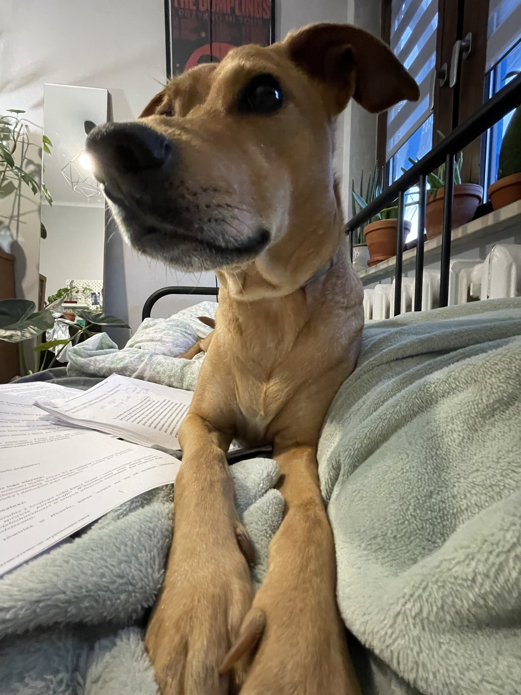

----
## Hi, what's up? That's my webstie.

#### My beloved dog chilling on me.

#### According to spotify wrapped this is my [favourite song](https://www.youtube.com/watch?v=RVmG_d3HKBA).

#### Recipe for my favorite desert - an apple pie:
> Ingredients
>> - 1 package pastry for a 9-inch double-crust pie
>> - 3/4 cup white sugar, or more to taste
>> - 1 teaspoon ground cinnamon
>> - 6 cups thinly sliced apples
>> - 1 tablespoon butter
>
> Directions
> 
>> 1. Preheat the oven to 230 degrees C.
>> 2. Line a 9-inch pie dish with one pastry crust; set second one aside.
>> 3. Combine 3/4 cup sugar and cinnamon in a small bowl. Add more sugar if your apples are tart.
>> 4. Layer apple slices in the prepared pie dish, sprinkling each layer with cinnamon-sugar mixture. Dot top layer with small pieces of butter. Cover with top crust.
>> 5. Bake pie on the lowest rack of the preheated oven for 10 minutes. Reduce oven temperature to 175 degrees C and continue baking until golden brown and filling bubbles, 30 to 35 minutes more. 
>> 6. Serve warm or cold. 

